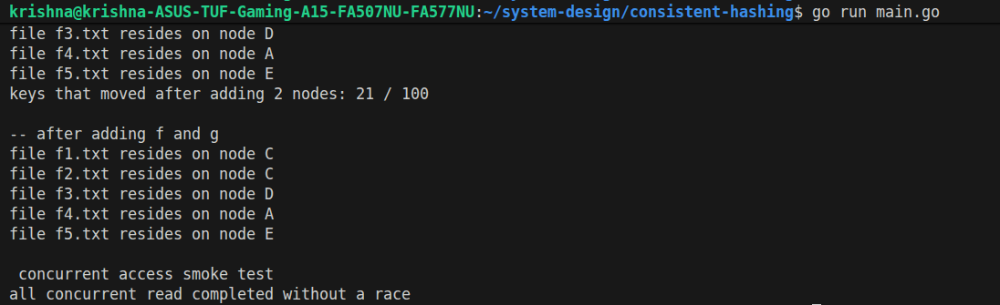

# Consistent Hashing Implementation

## Overview
This output demonstrates the functionality of a consistent hashing algorithm implemented in Go. Consistent hashing is used to distribute data across multiple nodes in a distributed system, minimizing the reorganization of data when nodes are added or removed.

## Code Explanation (`main.go`)
1. **Initialization:** A consistent hash ring is created with a replication factor of 100 (each node is represented by 100 virtual nodes on the ring).
2. **Adding Initial Nodes:** 5 storage nodes (A, B, C, D, E) are added to the ring.
3. **Initial Mapping:** It hashes 5 sample files (`f1.txt` to `f5.txt`) to determine which node they reside on and prints the result.
4. **Benchmarking Reallocation:** It maps 100 files (`file-0.txt` to `file-99.txt`) to their respective nodes and stores the initial mapping.
5. **Scaling Up:** 2 new nodes (F, G) are added to the ring to simulate scaling up the cluster.
6. **Measuring Key Movement:** It re-evaluates the locations of the 100 files and calculates how many were reassigned to a different node.
7. **Concurrency Test:** It spins up 50 concurrent goroutines to read from the ring simultaneously, verifying that the implementation is thread-safe and free of race conditions.

## Terminal Output

 

### Output Analysis
- **Initial Placement:** The first block shows the initial distribution of the 5 sample files across the nodes.
- **Minimal Data Movement:** When nodes F and G were added, **only 21 out of 100 keys (21%) moved**. In a traditional modulo-based hashing approach (`hash(key) % N`), adding a new node changes `N`, which would cause almost all keys to be reassigned. Consistent hashing successfully limits movement to approximately `K/N`, drastically reducing the overhead of data migrations during scaling.
- **Post-scaling Placement:** The 5 original files are looked up again, and their placements remain unchanged, highlighting the stability of the consistent hash ring.
- **Concurrency Check:** The final output confirms that the hash ring gracefully handles multiple concurrent read requests without data races.
